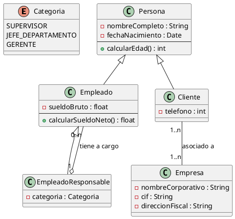
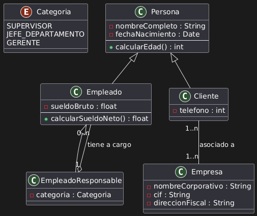

# Codigo uml

```plantuml
@startuml
enum Categoria {
    SUPERVISOR
    JEFE_DEPARTAMENTO
    GERENTE
}

class Persona {
    - nombreCompleto : String
    - fechaNacimiento : Date
    --
    + calcularEdad() : int
}

class Empleado {
    - sueldoBruto : float
    --
    + calcularSueldoNeto() : float
}

class EmpleadoResponsable {
    - categoria : Categoria
}

class Cliente {
    - telefono : int
}

class Empresa {
    - nombreCorporativo : String
    - cif : String
    - direccionFiscal : String
}

Persona <|-- Empleado
Persona <|-- Cliente
Empleado <|-- EmpleadoResponsable

EmpleadoResponsable "1" o-- "0..n" Empleado : tiene a cargo

Cliente "1..n" -- "1..n" Empresa : asociado a
@enduml
```

# Imagen diagrama

