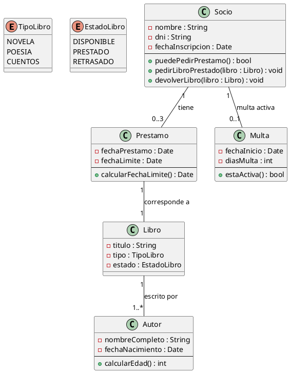
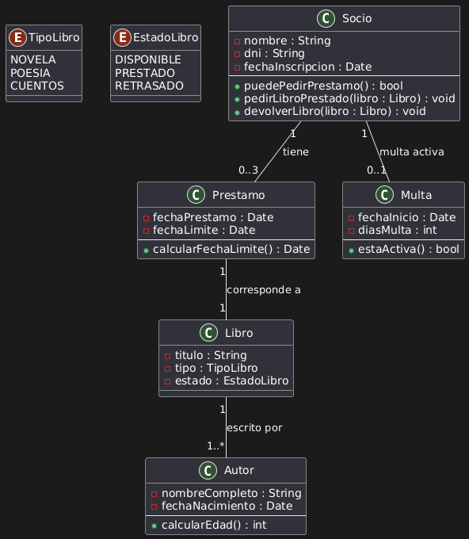

# Codigo uml

```plantuml
@startuml
enum TipoLibro {
    NOVELA
    POESIA
    CUENTOS
}

enum EstadoLibro {
    DISPONIBLE
    PRESTADO
    RETRASADO
}

class Autor {
    - nombreCompleto : String
    - fechaNacimiento : Date
    --
    + calcularEdad() : int
}

class Libro {
    - titulo : String
    - tipo : TipoLibro
    - estado : EstadoLibro
}

class Socio {
    - nombre : String
    - dni : String
    - fechaInscripcion : Date
    --
    + puedePedirPrestamo() : bool
    + pedirLibroPrestado(libro : Libro) : void
    + devolverLibro(libro : Libro) : void
}

class Prestamo {
    - fechaPrestamo : Date
    - fechaLimite : Date
    --
    + calcularFechaLimite() : Date
}

class Multa {
    - fechaInicio : Date
    - diasMulta : int
    --
    + estaActiva() : bool
}

Libro "1" -- "1..*" Autor : escrito por

Socio "1" -- "0..3" Prestamo : tiene

Prestamo "1" -- "1" Libro : corresponde a

Socio "1" -- "0..1" Multa : multa activa
@enduml
```

# Imagen diagrama

