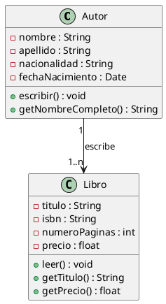
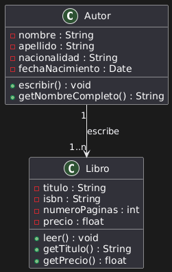

# Codigo uml

```plantuml
@startuml
class Autor {
    - nombre : String
    - apellido : String
    - nacionalidad : String
    - fechaNacimiento : Date
    + escribir() : void
    + getNombreCompleto() : String
}

class Libro {
    - titulo : String
    - isbn : String
    - numeroPaginas : int
    - precio : float
    + leer() : void
    + getTitulo() : String
    + getPrecio() : float
}
Autor "1" --> "1..n" Libro : escribe
@enduml
```

# Diagrama

