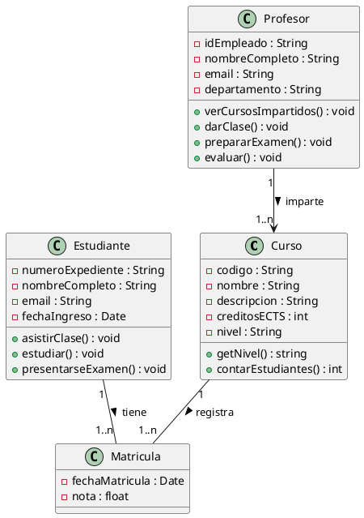
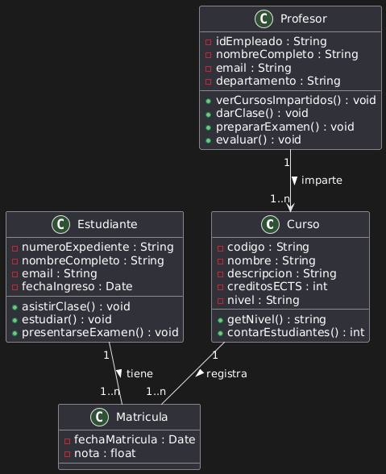

# Codigo uml

```plantuml
@startuml
class Curso {
    - codigo : String
    - nombre : String
    - descripcion : String
    - creditosECTS : int
    - nivel : String
    + getNivel() : string
    + contarEstudiantes() : int
}

class Profesor {
    - idEmpleado : String
    - nombreCompleto : String
    - email : String
    - departamento : String
    + verCursosImpartidos() : void
    + darClase() : void
    + prepararExamen() : void
    + evaluar() : void
}

class Estudiante {
    - numeroExpediente : String
    - nombreCompleto : String
    - email : String
    - fechaIngreso : Date
    + asistirClase() : void
    + estudiar() : void
    + presentarseExamen() : void
}

class Matricula {
    - fechaMatricula : Date
    - nota : float
}

Profesor "1" --> "1..n" Curso : imparte >
Estudiante "1" -- "1..n" Matricula : tiene >
Curso "1" -- "1..n" Matricula : registra >
@enduml
```

# Diagrama

